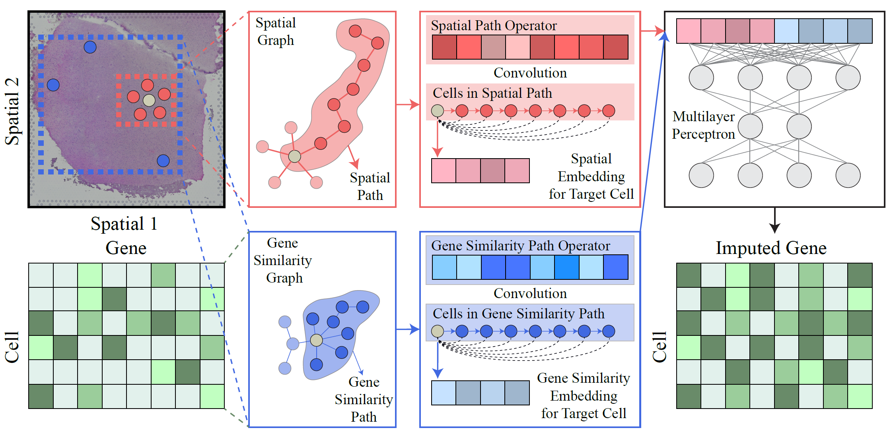

# Impeller
**Impeller**: A Path-Based Heterogeneous Graph Learning Method for Spatial Transcriptomic Data Imputation

## Overview


## Setup
Clone the repository. 
```
git clone https://github.com/aicb-ZhangLabs/Impeller.git
```

## Installation
Make sure you have the required dependencies installed.
Below are the packages and their specific versions required:

```
```bash
numpy==1.22.4
scipy==1.10.1
scikit-learn==1.2.1
torch==1.12.1
torch-geometric==2.2.0
torch-sparse==0.6.16
```

## File Descriptions

* data.py: Handles data preprocessing and dataset management.
* model.py: Contains the model architecture for Impeller.
* train.py: Code for training the Impeller model.
* utils.py: Utility functions supporting data handling, model operations, etc.

## Usage

```
python train.py
```

## Contact
For questions about the data and code, please contact zihend1@uci.edu. We will do our best to provide support and address any issues. We appreciate your feedback!